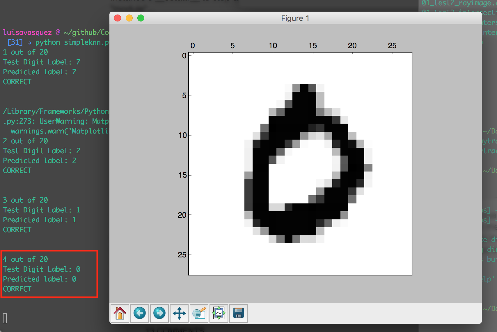
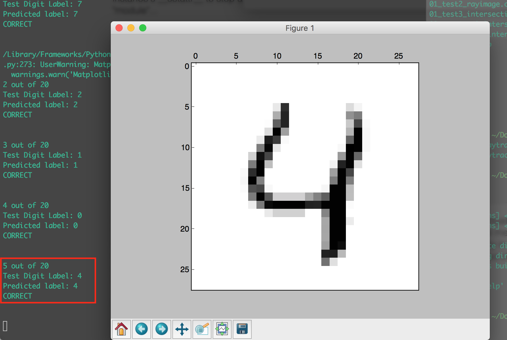
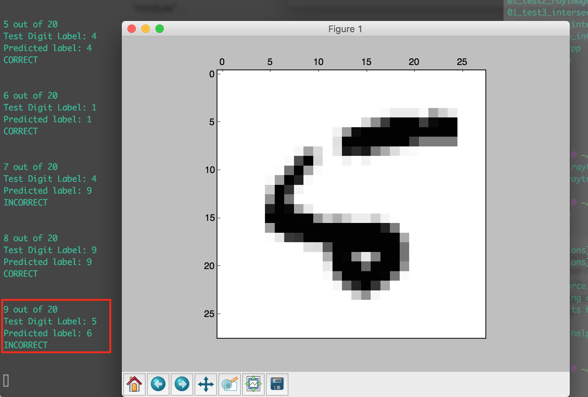
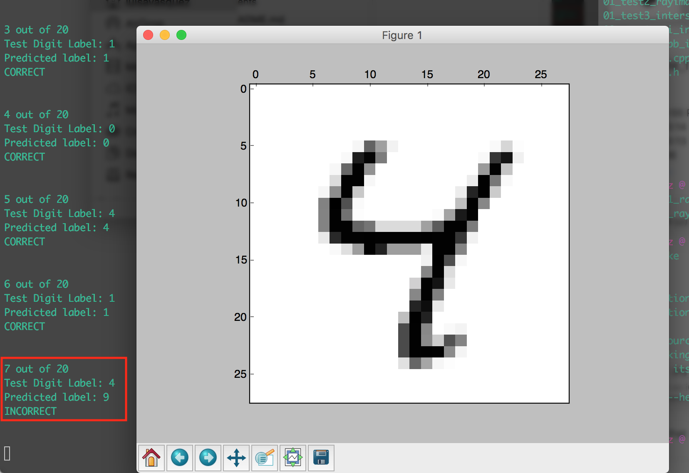

Luisa Vasquez

Fall 2017

Final Programming Project

## K Nearest Neighbor (kNN) Classifier for Handwriting Recognition

### Algorithm

I chose to implement the *K Nearest Neighbor Classifier* algorithm on the MNIST Database of handwritten digits. This algorithm is a supervised machine learning algorithm, which is sometimes referred to as a *lazy learner* because it leaves all of the computation until it is time to predict the classification of a certain input.

### Data:

"The MNIST database of handwritten digits, available from this page, has a training set of 60,000 examples, and a test set of 10,000 examples. It is a subset of a larger set available from NIST. The digits have been size-normalized and centered in a fixed-size image."

I used a couple of functions `read` and `show` from this code snippet: [https://gist.github.com/akesling/5358964](https://gist.github.com/akesling/5358964) to read in and process the data so that it would be in a python-friendly and numpy-friendly format.

## My Implementation

### 1. Calculating Distance

I implemented a straightforward distance formula to determine the "difference" between the test digit and the training digit. A larger distance indicated that two inputs are very different. A small distance value means that the two values are similar.

I used the **L1 distance** which calculates the pixel-wise absolute value difference. This function takes two inputs: the pixel data in vector form for the test number and the pixel data in vector form for the number from the training data set.

```python
def calcDistL1(testval, trainval):
    dist = np.sum(np.abs(testval-trainval))
    return dist
```

### 2. Returning k nearest neighbors


```python
def nearestNeighbor(testval):
    testlabel, testpixels = testval
    min_dist = 10000000
    distances = []
    for i in xrange(len(training_data)):
        tlabel, tpixels = training_data[i]
        dist = calcDistL1(testpixels, tpixels)
        data = (dist, tlabel)
        distances.append(data)
    distances.sort()
    return distances
```

Based on the parameter value of k that was passed in the main function, this function sorts the list by decreasing modes in order to determine k nearest neighbors.


```python
def knn(k, testDigitIndex):
    # show(testing_data[testDigitIndex][1])
    label = testing_data[testDigitIndex][0]
    print("Test Digit Label: " + str(label))
    sorted_dists = nearestNeighbor(testing_data[testDigitIndex])
    knnObjs = sorted_dists[:k]

    # strip list to be list of nearest labels
    nearest = []
    for x in xrange(len(knnObjs)):
        t, l = knnObjs[x]
        nearest.append(l)

    this_data = Counter(nearest)
    vote = this_data.most_common(1)
    prediction = vote[0][0]
    return (label, prediction)
```

### 3. Voting

The last part of the `knn` function, uses the list of nearest neighbors to "vote" on which of the returned labels is most popular.

```python
# strip list to be list of nearest labels
nearest = []
for x in xrange(len(knnObjs)):
    t, l = knnObjs[x]
    nearest.append(l)

this_data = Counter(nearest)
vote = this_data.most_common(1)
```

### 4. Running on Test dataset

Finally, in my `mainKNN` function I set up a loop that compares **x** numbers of the testing set with the training set and predicts what digit, 0-9, it would label it as.

```python
def mainKNN(testing_length, k):
    totalcorrect = 0
    for i in xrange(testing_length):
        print(str(i+1) + " out of " + str(testing_length))
        result = knn(5, i)
        l, p = result
        print("Predicted label: " + str(p))
        if l == p:
            print("CORRECT")
            totalcorrect = totalcorrect + 1.0
        else:
            print("INCORRECT")
        print("\n")
```
I then calculated the accuracy by keeping track of the number of correct predictions and returning a percentage at the end of the program.

```python
accuracy = float(totalcorrect / testing_length)*100.00
```

## Testing Algorithm Functionality (Evaluation)

#### Visual Confirmation
As I was writing and debugging the implementation of the algorithm I used numpy to read the image file into a separate window. This gave me the visual aid of seeing what the digit looked like in addition to having the text output from my program.

Here are a couple of examples of handwritten digits that were correctly labeled:





And here are a couple of digits that were incorrectly labeled:





## Conslusions + Results:

*Note: I ran these tests using the full training set of 60,000 examples.*

### Test 1:

*Settings: K value = 5, Number of training data points = 1000*

**Accuracy**: 74.8%

Program output:

```
980 out of 1000
Test Digit Label: 1
Predicted label: 1
CORRECT


981 out of 1000
Test Digit Label: 2
Predicted label: 2
CORRECT


982 out of 1000
Test Digit Label: 0
Predicted label: 0
CORRECT


983 out of 1000
Test Digit Label: 3
Predicted label: 8
INCORRECT


984 out of 1000
Test Digit Label: 8
Predicted label: 1
INCORRECT


985 out of 1000
Test Digit Label: 1
Predicted label: 1
CORRECT


986 out of 1000
Test Digit Label: 2
Predicted label: 2
CORRECT


987 out of 1000
Test Digit Label: 6
Predicted label: 6
CORRECT


988 out of 1000
Test Digit Label: 7
Predicted label: 7
CORRECT


989 out of 1000
Test Digit Label: 1
Predicted label: 1
CORRECT


990 out of 1000
Test Digit Label: 6
Predicted label: 6
CORRECT


991 out of 1000
Test Digit Label: 2
Predicted label: 1
INCORRECT


992 out of 1000
Test Digit Label: 3
Predicted label: 3
CORRECT


993 out of 1000
Test Digit Label: 9
Predicted label: 9
CORRECT


994 out of 1000
Test Digit Label: 0
Predicted label: 0
CORRECT


995 out of 1000
Test Digit Label: 1
Predicted label: 1
CORRECT


996 out of 1000
Test Digit Label: 2
Predicted label: 2
CORRECT


997 out of 1000
Test Digit Label: 2
Predicted label: 2
CORRECT


998 out of 1000
Test Digit Label: 0
Predicted label: 0
CORRECT


999 out of 1000
Test Digit Label: 8
Predicted label: 8
CORRECT


1000 out of 1000
Test Digit Label: 9
Predicted label: 9
CORRECT


Total correct: 748.0
Accuracy: 74.8%

```

### Test 2:

*Settings: K value = 2, Number of training data points = 50*

**Accuracy**: 70.0%

Program output:

```
40 out of 50
Test Digit Label: 1
Predicted label: 1
CORRECT


41 out of 50
Test Digit Label: 1
Predicted label: 1
CORRECT


42 out of 50
Test Digit Label: 7
Predicted label: 7
CORRECT


43 out of 50
Test Digit Label: 4
Predicted label: 4
CORRECT


44 out of 50
Test Digit Label: 2
Predicted label: 1
INCORRECT


45 out of 50
Test Digit Label: 3
Predicted label: 1
INCORRECT


46 out of 50
Test Digit Label: 5
Predicted label: 5
CORRECT


47 out of 50
Test Digit Label: 1
Predicted label: 1
CORRECT


48 out of 50
Test Digit Label: 2
Predicted label: 1
INCORRECT


49 out of 50
Test Digit Label: 4
Predicted label: 4
CORRECT


50 out of 50
Test Digit Label: 4
Predicted label: 4
CORRECT


Total correct: 35.0
Accuracy: 70.0%
```

### Test 3:

*Settings: K value = 10, Number of training data points = 50*

**Accuracy**: 80.0%

Program output:

```
40 out of 50
Test Digit Label: 1
Predicted label: 1
CORRECT


41 out of 50
Test Digit Label: 1
Predicted label: 1
CORRECT


42 out of 50
Test Digit Label: 7
Predicted label: 7
CORRECT


43 out of 50
Test Digit Label: 4
Predicted label: 4
CORRECT


44 out of 50
Test Digit Label: 2
Predicted label: 1
INCORRECT


45 out of 50
Test Digit Label: 3
Predicted label: 1
INCORRECT


46 out of 50
Test Digit Label: 5
Predicted label: 5
CORRECT


47 out of 50
Test Digit Label: 1
Predicted label: 1
CORRECT


48 out of 50
Test Digit Label: 2
Predicted label: 1
INCORRECT


49 out of 50
Test Digit Label: 4
Predicted label: 9
INCORRECT


50 out of 50
Test Digit Label: 4
Predicted label: 4
CORRECT


Total correct: 40.0
Accuracy: 80.0%
```

### Test 4:

*Settings: K value = 30, Number of training data points = 50*

**Accuracy**: 84.0%

Program output:

```
40 out of 50
Test Digit Label: 1
Predicted label: 1
CORRECT


41 out of 50
Test Digit Label: 1
Predicted label: 1
CORRECT


42 out of 50
Test Digit Label: 7
Predicted label: 7
CORRECT


43 out of 50
Test Digit Label: 4
Predicted label: 4
CORRECT


44 out of 50
Test Digit Label: 2
Predicted label: 1
INCORRECT


45 out of 50
Test Digit Label: 3
Predicted label: 1
INCORRECT


46 out of 50
Test Digit Label: 5
Predicted label: 5
CORRECT


47 out of 50
Test Digit Label: 1
Predicted label: 1
CORRECT


48 out of 50
Test Digit Label: 2
Predicted label: 1
INCORRECT


49 out of 50
Test Digit Label: 4
Predicted label: 9
INCORRECT


50 out of 50
Test Digit Label: 4
Predicted label: 4
CORRECT


Total correct: 42.0
Accuracy: 84.0%
```

## Next steps...
In the future, I'd like to explore different distance calculations to see how they affect error. On the MNIST website they indicate the error for different distance calculations--it fascinates me how much difference a more accurate distance formula can make.

Additionally I'd love to create a dynamic way to determine hyperparameters in a way that would make this implementation of the algorithm generalizable for different pixel-based datasets.

Unfortunately, for this assignment I did not have the time to run the full set of testing data through my algorithm, but I'm going to do that in the future to see how accurate the results are on a larger number data points.

### Resources:

Dataset:
[http://yann.lecun.com/exdb/mnist/](http://yann.lecun.com/exdb/mnist/)

Info that helped me determine what algorithm I wanted to implement: [http://yann.lecun.com/exdb/publis/pdf/lecun-95b.pdf](http://yann.lecun.com/exdb/publis/pdf/lecun-95b.pdf)

Conceptual information on classifiers and reference on a different implementation of nearest neighbors: [http://cs231n.github.io/classification/](http://cs231n.github.io/classification/)

For information on how to use numpy in python:
[http://cs231n.github.io/python-numpy-tutorial/](http://cs231n.github.io/python-numpy-tutorial/)

More background information on knn: [http://www.fon.hum.uva.nl/praat/manual/kNN_classifiers_1__What_is_a_kNN_classifier_.html](http://www.fon.hum.uva.nl/praat/manual/kNN_classifiers_1__What_is_a_kNN_classifier_.html)

For code on how to read MNIST handwritten database file types:
[https://gist.github.com/akesling/5358964](https://gist.github.com/akesling/5358964)
